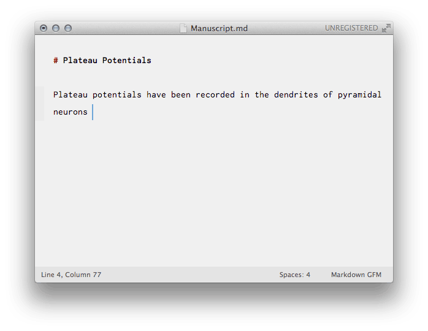

# Papers citations in Sublime Text

A Sublime Text 3 plugin to browse, cite and open papers from Mekentosj's [Papers 2](http://papersapp.com/).

It is similar to Paper's *Citations* feature, but cross-platform (eg. when sharing your Mac's Papers database with a Linux computer via Dropbox) and also lets you open PDFs directly from the text editor.

## Installation

Installation is currently a bit involved, see the instructions in the [main script](citations.py).

## TODO

- support Papers 3 & other reference managers
- install via package manager
- configuration options
